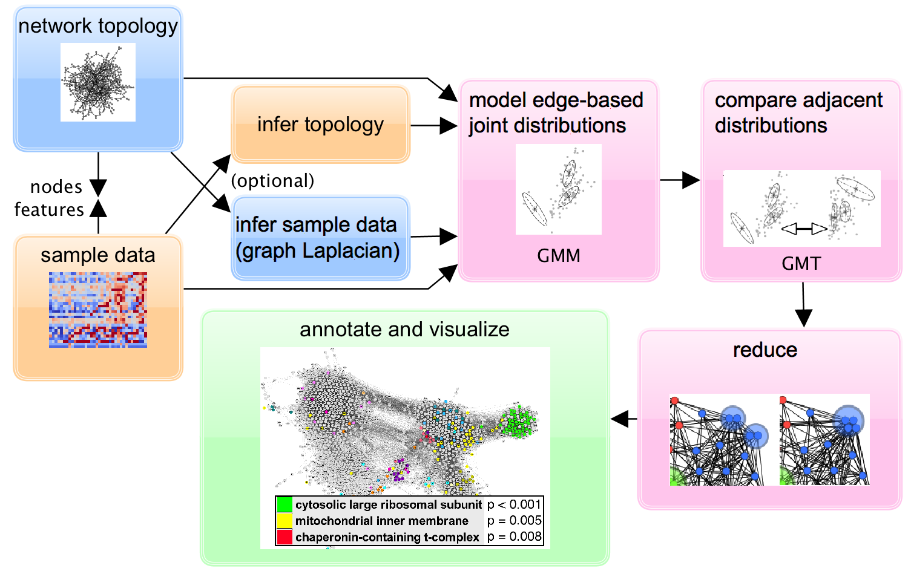
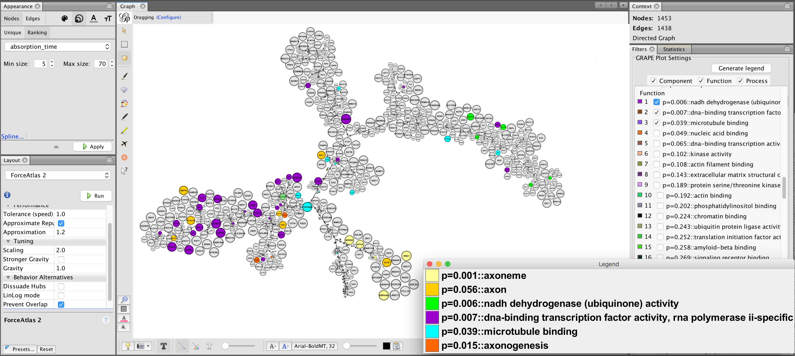

Functional Network Analysis
===========================



This repository contains the source code for an R package that generates weighted network models describing "functional profiles" found in a feature network. For gene networks the included [Gephi](https://gephi.org) plugin can be used to explore the models and related Gene Ontology annotations.

  1. **[Build workflow](#BuildWorkflow)** (skip this if you don't want to rebuild from source)
  2. **[Installation](#Installation)**
  3. **[Dependency notes](#DependencyNotes)**
  4. **[Example usage](#Example)**

Build workflow <a name="BuildWorkflow"></a>
--------------

Open up one *R session* and one *terminal session*.

In R,
```
install.packages(c("devtools", "roxygen2")) # If necessary
library(devtools)
library(roxygen2)
document('fna/')
```

You might already have all the dependencies installed, but if not go to [Dependency notes](#DependencyNotes) first. In the terminal session:
```
R CMD INSTALL fna
R CMD build fna
R CMD check fna_1.0.0.tar.gz
```

or just
```
./build.sh
```

For the Gephi plugin, clone and set up the plugin-development repository from their [website](https://gephi.org). Choose plugin type 'Filter' when prompted. Under `src/main/java/` make directory `fna/` and copy into it all the `.java` files from `gephi_plugin_code`. Then run

```
mvn clean package
```

For the above you need a Maven installation.

The `.nbm` file created somewhere in a `target` folder can be loaded directly into Gephi as a new plugin. You can select 'FNA Plot' from the 'Topology' category of filters.

Installation <a name="Installation"></a>
------------
Assuming you built/checked the R package, do the following:

```
install.packages("fna_1.0.0.tar.gz", repos=NULL, type="source")
library(fna)

help(generate_reduction) # To see usage of the main function, for example
```

Dependency notes <a name="DependencyNotes"></a>
----------------

```
install.packages(c("igraph","emdist","mclust","pbmcapply"))
```

If you want support for the GCT file format for gene expression data, use:

```
install.packages('BiocManager')
BiocManager::install("CePa")
```

For the GO annotation functionality you will need

```
BiocManager::install("rols")
```

and you will also need the `goa_human.gaf` annotation file available from the [EBI](https://www.ebi.ac.uk/GOA/downloads). `goa_human.gaf` is a somewhat large file (75mb), which is why it is not included here in this repository. For the most updated information, the script uses web API calls for the term definitions rather than a term definition file. However a partial cache file system is used to speed up repeated lookups.

Example Usage <a name="Example"></a>
-------------

After installation with `install.packages("fna_1.0.0.tar.gz", repos=NULL, type="source")`, open up an R session or RStudio and then run: 

```
source('lung_gtex_run.R')
```

This example uses lung tissue RNA expression data from GTEx. The file `example_data/lung_tissue_expression_gtex_abridged.csv` is abridged to the 1000 genes with the most variance in the original dataset available from the [GTEx portal](https://gtexportal.org/), for illustration purposes. You should see output like the following:

```
Calculating weighted network reduction based on

node_data_file:             example_data/lung_tissue_expression_gtex_abridged.csv
topology_file:              NA
correlation_transformation: none
normalization:              none
method:                     gmt

[1/6] Loading data and loading/building network
      Inferring feature network from data using Pearson correlation. (No topology_file supplied).
      Data set 427x1000 all numeric.
      Calculated correlations (1000x1000)
      Cutoff value for correlation: 0.65
      Inferred 6963 edges, out of possible 499500, with connectivity 0.0139399399399399
      Support of inferred graph contains 734 nodes.
      Average degree 18.9727520435967.
      Diameter 12.

[2/6] Integrating sample set and network data
      Number of nodes in network not in the data set: 0
      Number of nodes in the data set not in the network: 266
      RSL24D1 NXN CASP7 NDUFS4 LILRB5 ...
      Number of nodes in common: 734
      6963 edges after integrating dataset and feature network.

[3/6] Fitting Gaussian mixture models
      Number of cores according to parallel::detectCores(): 8
      Trying 7.
  |=========================================================================| 100%, Elapsed 01:12
      6963 2D models with 3 populations.

[4/6] Comparing all adjacent models
  |=========================================================================| 100%, Elapsed 01:22
      305546 adjacent edge pairs considered.

[5/6] Averaging over intermediating triangles to get virtual edges with weights
      305546 of 305546 edge pairs collated.
      40198 total virtual edges.

DONE
4.624307 mins

479120 lines to scan.
20608 relevant lines found in goa_human.gaf out of 479122 total lines read. (Elapsed 2.92 mins of expected total 2.92 mins)
```

You can open up the output file `example_data/lung_gtex_hierarchy_1000_annotated.graphml` in Gephi.

Gephi hints:

  1. Install the plugin NBM file into Gephi with Tools > Plugins > Downloaded > Add Plugin. Then find it under Filters > Topology > FNA Plot.
  2. Use the Force Directed Layout 2.
  3. Zoom out with the scroll wheel.
  4. Set the node size to be a function of the `absorption_time` attribute.
  5. Turn on labels coming from the `name` attribute.



**Annotation**. The Gene Ontology annotations are assessed for statistical significance as follows. The gene/term pairs listed in `goa_human.gaf` are filtered for the genes in the final hierarchy graph (approximately 750 genes in the example). Each term (annotation) that appears is thereby associated with a certain gene subset, certain leaf nodes in our weighted hierarchy tree (the edges of the hierarchy tree are weighted by a scaled level). For each such subset, the mean of the node-to-node pairwise weighted graph distances is calculated and regarded as a dispersal or coordination statistic. The statistical significance is measured with 10000-trial bootstrapping by random permutation of the gene set, with a p-value recording the fraction of the trials in which the statistic was lower than the observed value.
